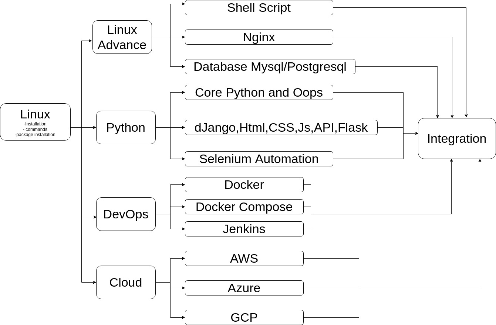

# LnxCT_Training
Its all about Train Developers On Linux,Python,Devops,and Cloud Technology.


#### Table of contents

- [LnxCT_Training](#lnxct_training)
      - [Table of contents](#table-of-contents)
- [LnxCT Training Plan](#lnxct-training-plan)
  - [Linux](#linux)
    - [Ubuntu Desktop Installation](#ubuntu-desktop-installation)
    - [Linux Basic Commands](#linux-basic-commands)
    - [Linux Advanced Commands](#linux-advanced-commands)
    - [Linux Vi Editor Commands](#linux-vi-editor-commands)
    - [Linux Git Usage](#linux-git-usage)
    - [Install Required Tools](#install-required-tools)
    - [Ubuntu Server Installation](#ubuntu-server-installation)
    - [Linux Directory Structure](#linux-directory-structure)
    - [CentOS vs Ubuntu](#centos-vs-ubuntu)
    - [CentOs Server Installation](#centos-server-installation)
    - [Linux Test](#linux-test)
  - [Shell Script](#shell-script)
  - [Nginx](#nginx)
    - [Nginx Installation,Configuration](#nginx-installationconfiguration)
    - [Nginx SSL Certificate and Reverse Proxy](#nginx-ssl-certificate-and-reverse-proxy)
  - [Database](#database)
    - [MySQL/MariaDB](#mysqlmariadb)
      - [MySQL/MariaDB Installation](#mysqlmariadb-installation)
      - [MySQL/MariaDB Commands](#mysqlmariadb-commands)
    - [PostgreSQL](#postgresql)
      - [PostgreSQL Installation](#postgresql-installation)
      - [PostgreSQL Commands](#postgresql-commands)
    - [Terraform](#terraform)


# LnxCT Training Plan


## Linux
### Ubuntu Desktop Installation
```
https://ubuntu.com/tutorials/install-ubuntu-desktop#1-overview
```
**End Result**
You must able to install ubuntu using bootable pendrive

### Linux Basic Commands
```
https://maker.pro/linux/tutorial/basic-linux-commands-for-beginners
https://www.hostinger.in/tutorials/linux-commands
```
**End Result**
You must have knowledge of all above command by doing practice on terminal.

### Linux Advanced Commands
```
https://blog.knoldus.com/play-with-text-in-linux-grep-cut-awk-sed/
https://itsfoss.com/linux-command-tricks/
https://www.tecmint.com/20-advanced-commands-for-linux-experts/
https://haydenjames.io/90-linux-commands-frequently-used-by-linux-sysadmins/
```
**End Result**
You must have knowledge of all above advance commands

### Linux Vi Editor Commands
```
https://www.guru99.com/the-vi-editor.html
```
**End Result**
You must have knowledge of how to use vi editors using commands


### Linux Git Usage
```
https://linuxhint.com/git_tutorial_beginners/
https://www.youtube.com/watch?v=8JJ101D3knE
```
**End Result**
You must have knowledge of how to use git and how to manage source code.

### Install Required Tools
```
1. Chrome Browser
2. visual studio code
3. Virtual Box
4. Git
```
**End Result**
You must have knowledge of how to install above tools and how to use above tools.

### Ubuntu Server Installation
```
* install ubuntu server into VirtualBox
https://ubuntu.com/tutorials/install-ubuntu-server#1-overview
```
**End Result**
You must have knowledge of how to install ubuntu server on VirtualBox and How to access VirtualBox Using SSH.

### Linux Directory Structure
```
https://www.thegeekstuff.com/2010/09/linux-file-system-structure/
https://www.tecmint.com/linux-directory-structure-and-important-files-paths-explained/
```
**End Result**
You must have knowledge of Which File where exist and where need to modify according needs.

### CentOS vs Ubuntu
```
https://www.educba.com/centos-vs-ubuntu/
https://cmdref.net/os/linux/note/rhel-vs-ubuntu
```
**End Result**
You must have knowledge of Which Os in which types of commands used for install packages or service relalted.

### CentOs Server Installation
```
https://www.webmo.net/support/centos72.html
```
**End Result**
You must have knowledge of How To Install CentOS server and how to Operate CentOS

### Linux Test
```
https://www.testdome.com/tests/linux-online-test/81
https://www.guru99.com/linux-certification-quiz.html
https://searchdatacenter.techtarget.com/quiz/Test-your-knowledge-of-useful-Linux-commands-with-this-quiz
```
**End Result**
You must have complete knowledge of Linux(Ubuntu/CentOS),All Commands ,Directory Structure.
you need to  Perform above types of 5 Linux Test and check your Linux Knowledge.


## Shell Script
```
https://linuxconfig.org/bash-scripting-tutorial
https://linuxhint.com/30_bash_script_examples/
https://www.shellscript.sh/
```
**End Result**
You must have knowledge of How to Write Shell Script according needs.

## Nginx 
NOTE: Perform This Tutorial After Python Flask Tutorial.

### Nginx Installation,Configuration
```
https://phoenixnap.com/kb/how-to-install-nginx-on-ubuntu-20-04
```

### Nginx SSL Certificate and Reverse Proxy
```
https://www.digitalocean.com/community/tutorials/how-to-create-a-self-signed-ssl-certificate-for-nginx-in-ubuntu-20-04-1
https://www.digitalocean.com/community/tutorials/how-to-secure-nginx-with-let-s-encrypt-on-ubuntu-20-04
https://bitlaunch.io/blog/how-to-use-nginx-as-a-reverse-proxy-on-ubuntu-20-04/
https://www.scaleway.com/en/docs/tutorials/nginx-reverse-proxy/
```
**End Result**
You must have knowledge of How to Install,Configure,Create Certificate,Rule Writing, Proxy Pass


## Database
### MySQL/MariaDB
#### MySQL/MariaDB Installation
```
https://www.linuxtechi.com/install-mariadb-in-ubuntu/
```

#### MySQL/MariaDB Commands
```
https://www.tecmint.com/learn-mysql-mariadb-for-beginners/
https://www.tecmint.com/mysqladmin-commands-for-database-administration-in-linux/
```

**End Result**
You must have knowledge of How to Install,Create Database, CRUD Operation Using commands Query,backup and restore database

### PostgreSQL
#### PostgreSQL Installation

```
https://www.digitalocean.com/community/tutorials/how-to-install-postgresql-on-ubuntu-20-04-quickstart
```

#### PostgreSQL Commands
```
https://www.geeksforgeeks.org/postgresql-psql-commands/
https://www.tecmint.com/backup-and-restore-postgresql-database/
```

**End Result**
You must have knowledge of How to Install,Create Database, CRUD Operation Using commands Query,backup and restore database


### Terraform
```
https://www.youtube.com/watch?v=l5k1ai_GBDE
https://learn.hashicorp.com/collections/terraform/aws-get-started
https://www.youtube.com/watch?v=SLB_c_ayRMo
https://github.com/easyawslearn/Terraform-Tutorial
```
**End Result**
You must have knowledge of How to Create IAAS using Terraform for AWS,Azure,GCP.
